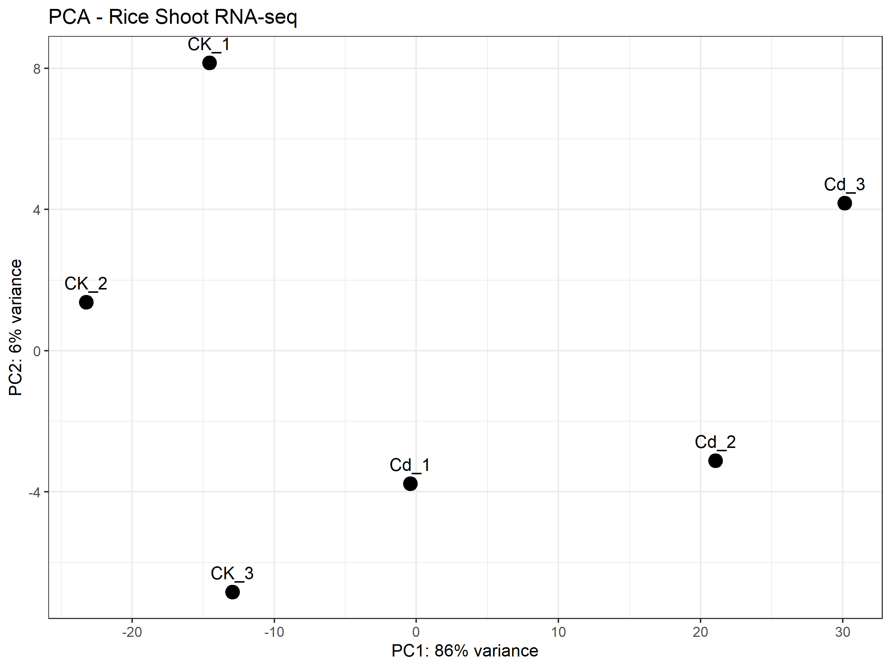
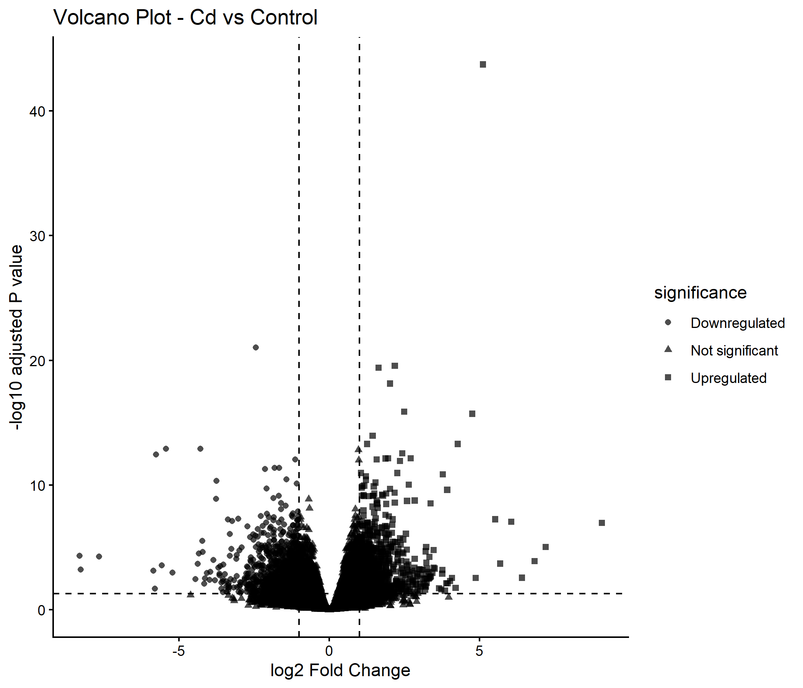

# Rice shoot RNA-seq response to cadmium stress

An independent reanalysis of public paired-end RNA-seq data from rice shoots exposed to cadmium. The project follows the analysis from read quality control through genome alignment, gene-level counting, differential expression and functional enrichment.

Repository status publication draft. The reported findings and extracted figures are available. Historical scripts are included for transparency. Final executed scripts, metadata, count/result tables and software-version records still need to be added before this repository supports a complete rerun. See [reproducibility notes](docs/REPRODUCIBILITY.md).

## Study design

| Item | Description |
| --- | --- |
| Organism and tissue | Oryza sativa, shoots |
| Comparison | 75 µM CdCl₂ versus untreated control |
| Exposure duration | 7 days |
| Libraries | 6 paired-end libraries, 3 biological replicates per condition |
| Public study | [PRJNA544413](https://www.ncbi.nlm.nih.gov/bioproject/PRJNA544413) |
| Reference used in the project | IRGSP-1.0 genome with corresponding rice gene annotation |
| Original publication | [Sun et al. (2019), Scientific Reports](https://doi.org/10.1038/s41598-019-46684-w) |

The experiment and sequencing were performed by the original study authors. This repository documents a computational reanalysis. Run-to-condition assignments are documented in [metadata notes](metadata/README.md).

## Workflow

| Stage | Tools | Output |
| --- | --- | --- |
| Raw and trimmed read QC | FastQC, MultiQC | Per-file and combined QC reports |
| Adapter and quality trimming | Trimmomatic | Retained paired reads and separate unpaired outputs |
| Splice-aware genome alignment | HISAT2 | Genome alignments |
| Alignment processing and QC | SAMtools | Sorted/indexed BAMs and flagstat reports |
| Gene-level quantification | featureCounts | Unnormalized count matrix and assignment summary |
| Differential expression | DESeq2 | Cd-versus-Control statistics and DEG tables |
| Exploratory plots | DESeq2, ggplot2, pheatmap | PCA, correlations, distances, heatmap, MA and volcano plots |
| Functional enrichment | clusterProfiler, BioMart GO annotations, KEGG | GO and pathway enrichment tables |

The archived trimming command uses `SLIDINGWINDOW:5:20` and `MINLEN:50`. DESeq2 retains features with at least 10 counts in at least 3 samples and uses `~ condition`. The comparison is Cd versus Control. Significant features satisfy **BH-adjusted P < 0.05 and |log₂ fold change| ≥ 1**. See [methods](docs/METHODS.md) for the recorded settings and their limits.

## Reported results

| Result | Reported value |
| --- | ---: |
| Features retained for DESeq2 | 21,179 |
| Significant differentially expressed features | 1,780 |
| Upregulated in Cd | 845 |
| Downregulated in Cd | 935 |
| Variance represented by PC1 | 86% |
| Variance represented by PC2 | 6% |

These values were transcribed from the project report and have not been recomputed from the count matrix during repository preparation. The significant total includes 1,778 nuclear `Os` identifiers and two chloroplast tRNA-related features according to that report.

Enrichment highlighted photosynthesis and chloroplast functions, redox-related processes, and amino-acid and secondary metabolism. These are transcript-level associations; enrichment alone does not establish a change in pathway activity or plant physiology.

### Sample relationships

PC1 captures a major treatment-associated pattern, but Cd_1 occupies an intermediate position. The correlation and distance heatmaps also place Cd_1 closer to some control samples than to the other treated samples. The groups therefore do not show uniformly clean separation. PC1's 86% describes variance in the PCA input, not a percentage of variance proven to be caused by cadmium.

### Differential expression

Positive log₂ fold changes indicate higher expression in Cd; negative values indicate lower expression. The thresholds define statistical and effect-size criteria, not experimental validation.

### Functional interpretation

This plot summarizes selected GO terms from the report. Bar length represents fold enrichment, not expression fold change or statistical significance. The full enrichment tables are needed to inspect adjusted P values, gene sets and annotation coverage.

More figures and their provenance are in [figures](figures/). Additional findings and limitations are in the [results summary](docs/).

## Files

| Folder | Contents |
| --- | --- |
| [metadata]| Sample mapping and instructions for adding the final metadata |
| [scripts] | Historical script copies, final-script locations and path-edit instructions |
| [results/counts] | Location for the count matrix and assignment summary |
| [results/differential_expression]| Location for complete and filtered DESeq2 tables |
| [results/enrichment] | Location for GO and KEGG result tables |
| [figures] | Extracted project figures |
| [logs]| Location for commands and run summaries |
| [annotation] | Reference and annotation provenance requirements |
| [docs] | Methods, results, references and reproducibility notes |

## Reusing the analysis

This is currently a documented case study, not a verified one-command pipeline. Start with [reproducibility notes](docs/REPRODUCIBILITY.md). Large sequencing and alignment files are not distributed here. Retrieve reads through the public accessions and use the exact reference and annotation versions recorded with the final run.

The independent workflow can differ from the original publication in software, annotation, filtering and significance criteria. Biological agreement should be assessed from supported gene/pathway results rather than requiring an identical DEG total.

## Acknowledgments and references

Credit the original experiment and dataset to Sun, L., Wang, J., Song, K., Sun, Y., Qin, Q., & Xue, Y. (2019). Transcriptome analysis of rice (Oryza sativa L.) shoots responsive to cadmium stress. Scientific Reports, 9, 10177. https://doi.org/10.1038/s41598-019-46684-w
